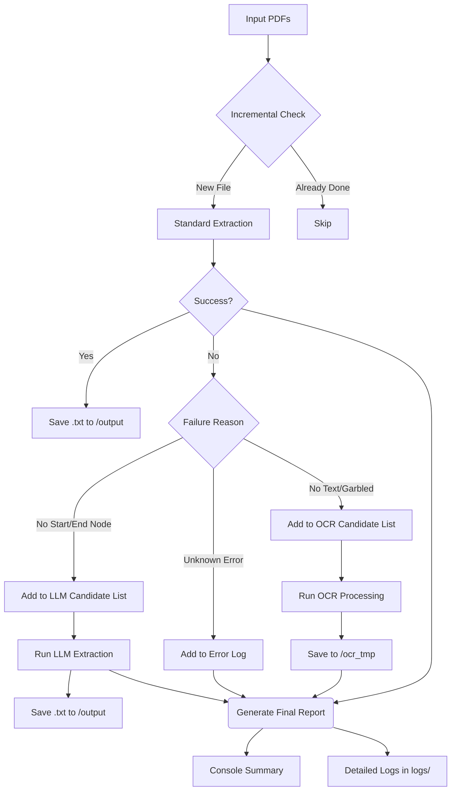

# PDF MD&A Extractor (v2.0)

> **[中文文档 (Chinese Documentation)](README_zh-CN.md)**

An enhanced tool for extracting **"Management Discussion and Analysis" (MD&A)** sections from Annual Reports (PDF). This version features a simplified architecture, improved configuration, and fallback mechanisms using **OCR** (for scanned docs) and **LLM** (for complex structures).

## 🚀 Key Features

1. **Enhanced Basic Extraction**: Improved extraction logic provides cleaner, more accurate text compared to the previous version. Automatically removes duplicate characters caused by parsing errors, significantly boosting the success rate of standard extraction.
2. **Optimized LLM Integration**: Simplified the LLM calling process. Added API Key pool management and automatic token limit calculation. By calculating the extraction range using the difference between directory page numbers and actual page labels, Input Token consumption is drastically reduced.
3. **Smart OCR Repair**: Automatically applies OCR processing to files that are unreadable or time out, and then re-attempts extraction on the repaired files.
4. **Detailed Error Reporting**: Provides comprehensive error reasons for any files that ultimately fail processing.

## 📊 Workflow



## 🛠️ Usage

### 1. Installation

This project uses `uv` for dependency management.

```bash
# Install dependencies
uv sync
```

### 2. Preparation & Running

**Step 1: Prepare Folders**
Manually create a folder named `input` in the project root directory and place all PDF files to be analyzed inside it.
*(Note: `output` and `logs` folders will be automatically created by the program.)*

**Step 2: Run Program**

```bash
uv run python -m src.main
```

> **Why this command?**
>
> * `uv run`: Ensures the command runs within the project's isolated virtual environment.
> * `python -m src.main`: Runs `src/main.py` as a module.
>   * (Note: You MUST use `-m src.main` instead of `src/main.py` to ensure relative imports within the `src` package work correctly.)

**Results:**

1. **Success**: Extracted `.txt` files will be saved in the `output/` folder.
2. **Tracking**: All execution logs (including failure reasons and skipped files) are saved in the `logs/` folder.
    * If "OCR processed" appears, check `ocr_tmp/` for repaired PDFs.
    * If "Failed" appears, check `logs/process.log` for detailed error stacks.

### 3. Advanced Arguments (Optional)

Use these arguments only if you need custom paths or advanced AI features:

* `--llm`: Enable LLM fallback (requires API Key in `src/config.py`).
* `--input /path`: Specify a custom input folder.
* `--output /path`: Specify a custom output folder.
* `--cpu N`: Specify the number of parallel CPU cores.

**Example: Enable LLM Fallback**

```bash
uv run python -m src.main --llm
```

## 📂 File Structure

* **`src/main.py`**: **Entry Point**. Orchestrates the entire extraction process.
* **`src/config.py`**: **Configuration**. Modify this to add API Keys or adjust parameters.
* **`src/extractor.py`**: Core extraction logic based on Regex.
* **`src/ocr_extractor.py`**: Module for repairing PDFs using `ocrmypdf`.
* **`src/llm_extractor.py`**: Module for AI-based content extraction.
* **`logs/`**: Directory for execution logs.
* **`ocr_tmp/`**: Directory for OCR-repaired PDF files.
