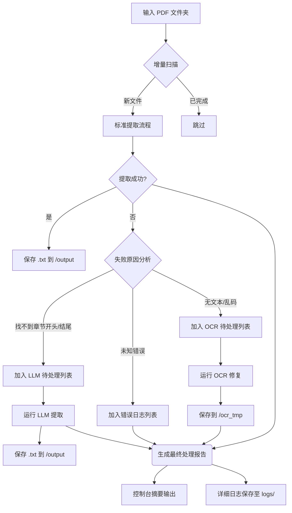

# PDF 年报 MD&A 提取工具 (v2.0)

> **[English Documentation (英文文档)](README.md)**

这是针对 A 股年报 PDF 进行 **"管理层讨论与分析" (MD&A)** 章节提取的升级版工具。新版本简化了代码架构，优化了配置方式，并增加了针对**错误解析文件**的 **OCR 修复** 和针对**特异性情况文件**的 **LLM (大模型)** 兜底提取功能。

## 🚀 核心功能

1. **基础提取增强**: 相比上一代，改进了文本提取逻辑，能够更准确、干净地提取文本。自动剔除解析错误的重复字符，显著提高了基础提取的成功率。
2. **LLM 调用优化**: 简化了 LLM 调用流程。增加了 API Key 池管理，自动计算 Token 上限，并利用目录页码与实际页码的差值来精确计算提取范围，大幅减少 Input Token 消耗。
3. **智能 OCR 修复**: 针对无法读取文本或处理超时的文件，自动进行 OCR 处理，并对修复成功的文件进行二次读取。
4. **详细错误报告**: 对于最终无法处理的文件，提供详细的错误原因报告。

## 📊 处理流程图

(注：GitHub/GitLab/VS Code 可直接渲染以下流程图)



## 🛠️ 使用指南

### 1. 安装依赖

本项目使用 `uv` 进行快速依赖管理。

```bash
# 同步安装依赖
uv sync
```

### 2. 准备与运行

**第一步：准备文件夹**
请在项目根目录下创建一个名为 `input` 的文件夹，并将所有需要分析的 PDF 文件放入其中。
*(注：`output` 和 `logs` 文件夹程序会自动创建，无需手动新建)*

**第二步：运行程序**

```bash
uv run python -m src.main
```

> **参数说明：**
>
> * `uv run`: 确保命令在项目隔离的虚拟环境中执行。
> * `python -m src.main`: 以模块方式运行 `src/main.py`。
>   * (注：必须使用 `-m src.main` 而不能直接 `python src/main.py`，因为项目内部使用了相对引用，需要加载整个 `src` 包结构)

**运行结果：**

1. **成功提取**：生成的 `.txt` 文件会保存在 `output/` 文件夹中。
2. **错误追踪**：所有运行日志（包含失败原因、跳过的文件）会保存在 `logs/` 文件夹下。
    * 如果控制台提示“OCR processed”，请去 `ocr_tmp/` 查看修复后的 PDF。
    * 如果控制台提示“Failed”，请查看 `logs/process.log` (默认) 获取详细报错栈。

### 3. 高级参数 (可选)

如果您需要自定义路径或开启高级 AI 功能，可以使用以下参数：

* `--llm`: 开启大模型兜底（需要在 `src/config.py` 配置 Key）。
* `--input /路径`: 指定非默认的输入文件夹。
* `--output /路径`: 指定非默认的输出文件夹。
* `--cpu N`: 指定并行的 CPU 核心数。

**示例：开启 LLM 兜底功能**

```bash
uv run python -m src.main --llm
```

## 📂 文件结构说明

* **`src/main.py`**: **主入口**。控制整个提取流程。
* **`src/config.py`**: **配置文件**。修改此文件来配置 API Key 或调整参数。
* **`src/extractor.py`**: 基于正则表达式的核心提取逻辑。
* **`src/ocr_extractor.py`**: 调用 `ocrmypdf` 进行修复的模块。
* **`src/llm_extractor.py`**: 调用大模型接口进行智能提取的模块。
* **`logs/`**: 存放运行日志。
* **`ocr_tmp/`**: 存放经过 OCR 修复后的 PDF 文件。
